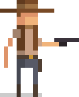

# Shoot 'Em! - A DOM manipulation shooting game

## Description

"Shoot 'Em!" is a game where the player will have to shoot at birds to earn points before time runs up.

## Instructions

- Movement: Use arrow keys "left" and "right" to turn in the direction you want to shoot
- Shooting: Use the spacebar to shoot.

## Demo

[Try the game!](https://navitat.github.io/project-1-game/)

## Known Bugs

- when a bullet hits an element that just disappeared, points might go up
- Bullets dont appear from the exact position of the "pistol" on the player image
